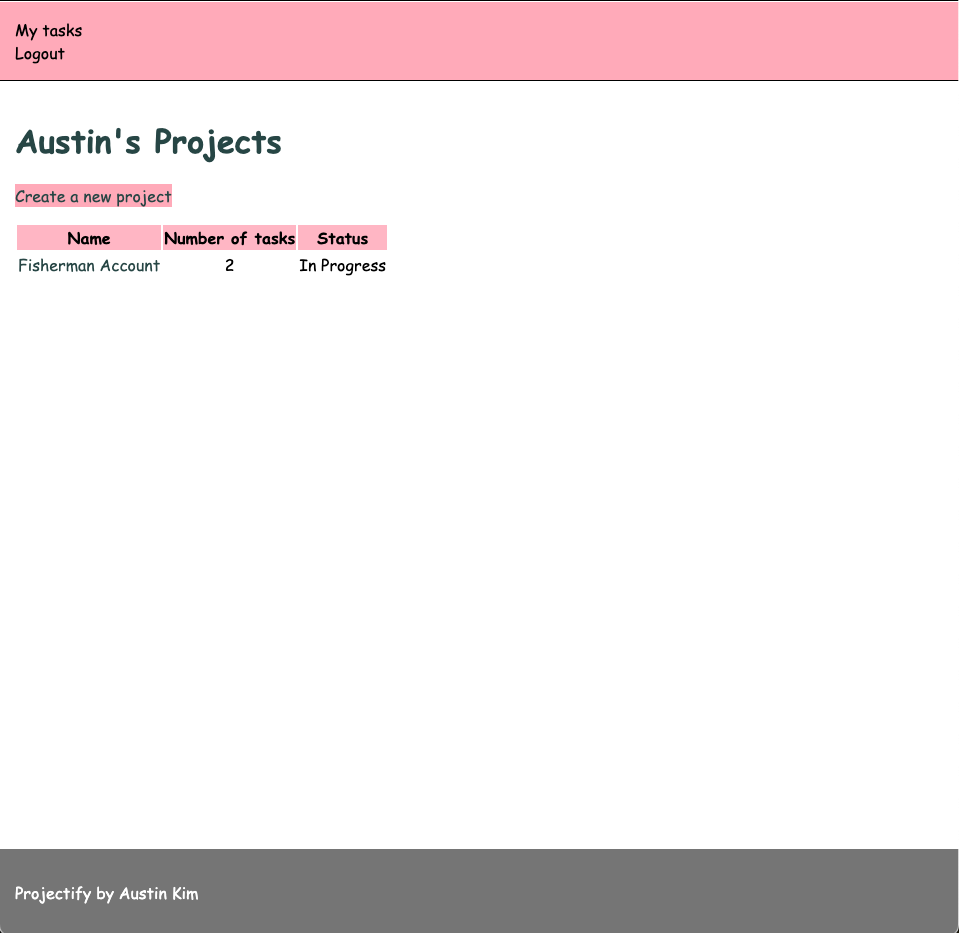
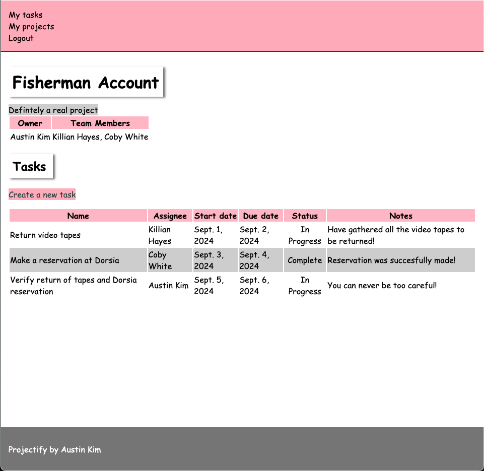
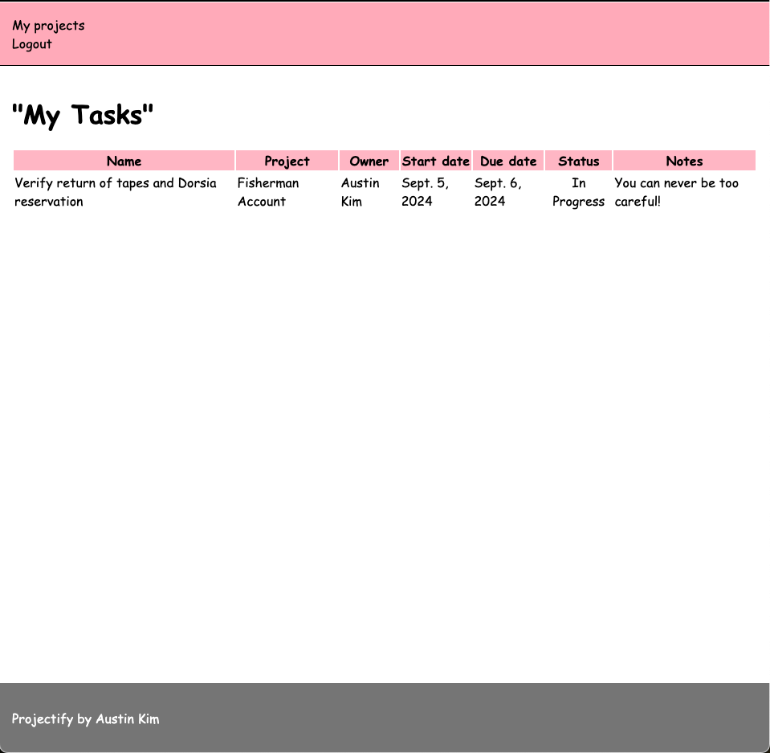

# Projector

## High Level Overview

Projector is a project management application that differentiates user privileges based on the role that user plays on that project. Project owners (managers) have editing/deleting privileges, while team members (ICs) have viewing privileges and can add/edit their own task notes.







## Getting Started
1. Clone the following repository onto your local computer:
```
git clone https://github.com/austintkim/Projector.git
````

2. CD into new project directory

3. Run the following command in your terminal to install the relevant files and packages for this project:
```
pip install --upgrade pip
pip install - r requirements.txt
```

4. Create a Django superuser
```
python manage.py createsuperuser
```

5. Answer the prompts that populate in your terminal - it will ask for:
     - A **required** username
     - An optional email address
     - A **required** password
     - A **required** password confirmation

6. Run the following command to start your local development server:
```
python manage.py runserver
```

7. Type localhost:8000/admin/ into your browser to access Django admin:
    - Log in as a superuser using the credentials you input earlier
    - Feel free to add and remove Users and Groups as you please

8. View the project in the browser: http://localhost:8000/

9. Explore and enjoy!
